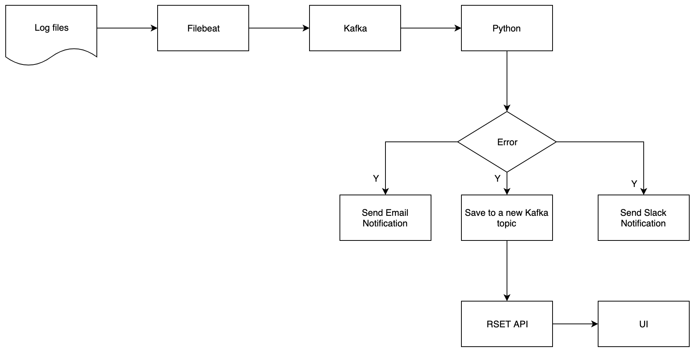
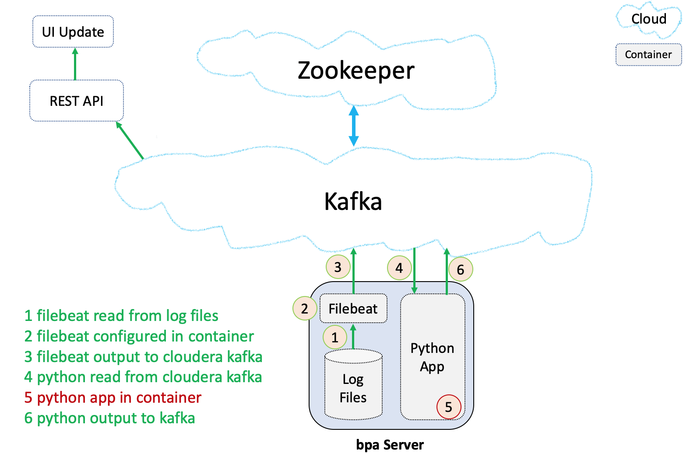
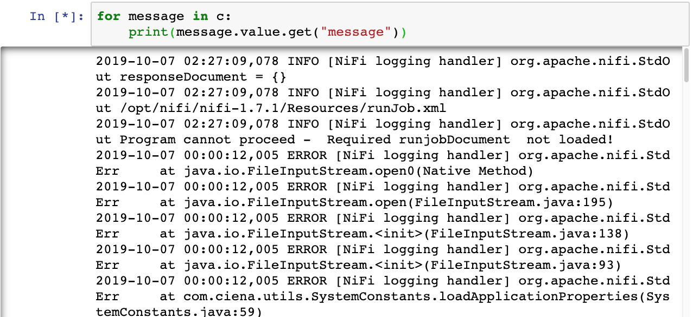
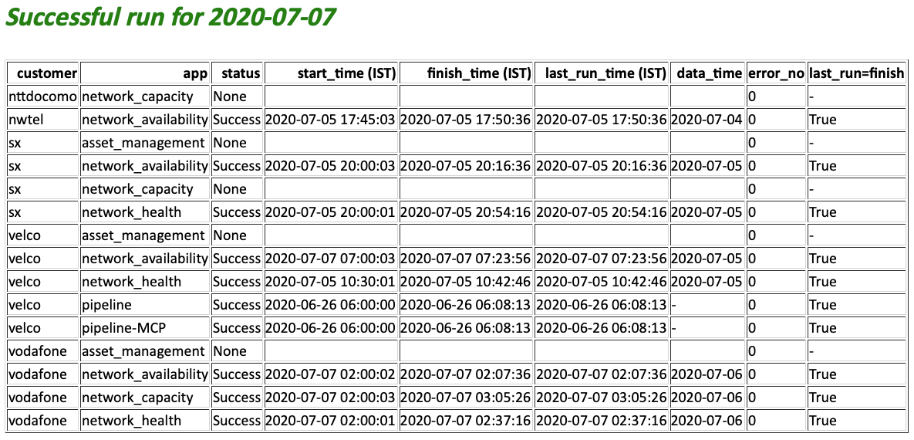

# Introduction of Automated Reporting Project

### Project Description:

This project aims to monitor the log of serveral apps like Network Health, Network Availability, Pipeline, Asset Management, Network Capacity to determine the health of the running status of each app and send notification via email and slack to support team. 

### Project Structure:
1. This project was implementing mainly by using filebeat, kafka, python 
2. The filebeat monitors the separate logs and output those new coming messages to different Cloudera Kafka topics
3. Python app reads the messages of different apps from different Cloudera Kafka topics and proceeds the parsing ,analysis and diagnosis of each messages, and sends analysis report automatically to email and Slack using API. 

#### The original log example:

#### The email Analysis report example:

The email notification example is as below. The table is first ordered by the customer column, and  second ordered by the status column as the order(Failure,None, Success)

Regarding to Business information Security, the code of this project can't be share as it's property of previous company.

